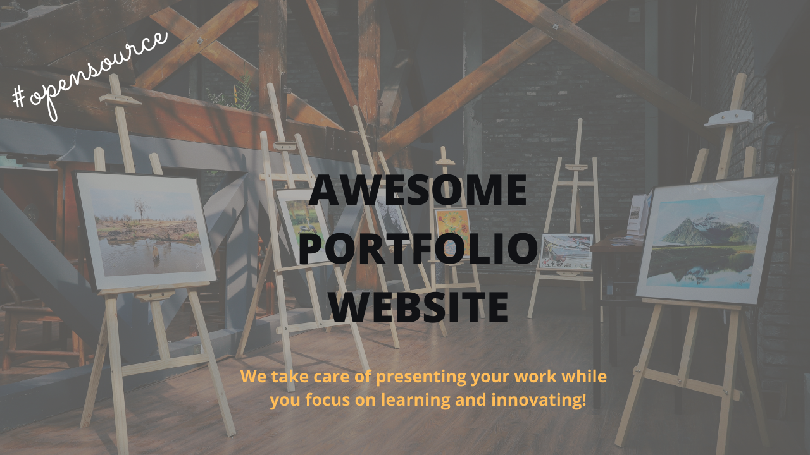
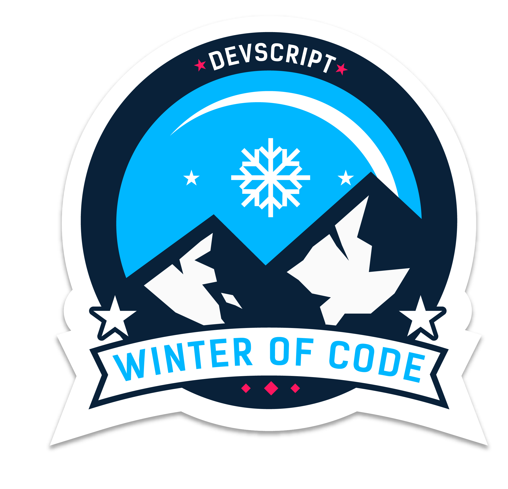
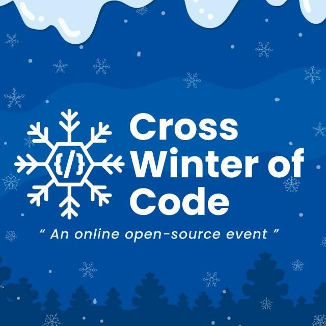

A community maintained open source project aimed at making personal portfolio for researchers, developers and analysts simple, fast and less cumbersome. We make sure you have a full-fledged website to showcase your work while you can spend time on your learning and innovative endeavours.

## Open Source Programs we have been a part of:

